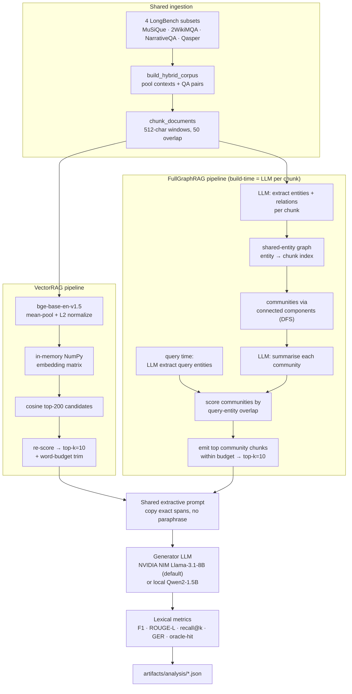
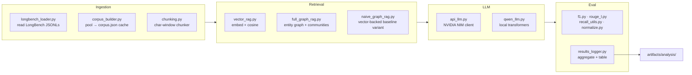

# GraphRAG vs. VectorRAG

**A controlled research harness that isolates the effect of retrieval strategy — dense vector search vs. an LLM-built entity graph — on question answering over a shared, noisy corpus.**

This is a *methodology-first* study, not a benchmark. Every component except the retriever is held constant (same generator LLM, same extractive prompt, same word budget, same lexical metrics) so that any difference in the scores can be attributed to *how evidence is retrieved*, and to nothing else.

---

## Overview

Retrieval-Augmented Generation (RAG) systems differ mostly in one place: how they find the passages they feed to the language model. Two families dominate:

- **VectorRAG** — embed every chunk, embed the query, return the chunks with the highest cosine similarity. Fast, simple, semantically fuzzy.
- **GraphRAG** — have an LLM read each chunk and extract entities/relations, link chunks that share entities into *communities*, summarise each community, then route a query to communities through the entities it mentions. Slower and far more expensive to build, but structurally aware of cross-document connections.

The question this repo tries to answer honestly is: *when you change only the retriever and hold everything else fixed, what actually changes?* To make the comparison hard for both sides, all four source datasets are pooled into a **single mixed corpus**, so every query must find its evidence inside one large, noisy pool rather than in a clean per-dataset context.

This is a small, reproducible experiment scaffold. The committed run is a 40-question illustrative slice (10 questions from each of 4 datasets), not a leaderboard submission.

---

## Key Features

- **Two full retrieval pipelines, one generator.** `VectorRAG` (dense) and `FullGraphRAG` (LLM entity graph) are evaluated head-to-head in a single run.
- **Everything-but-retrieval held constant.** Identical generator LLM, identical extractive answer prompt, identical word/token budget, identical metrics for both pipelines.
- **Pooled multi-dataset corpus.** MuSiQue, 2WikiMQA, NarrativeQA and Qasper (via LongBench) are merged into one shared context pool.
- **Self-contained, dependency-light metrics.** F1, ROUGE-L, recall@k, gold-evidence-recall and an oracle entity-hit diagnostic are all implemented from scratch — no `rouge`, no `datasets`, no eval framework.
- **Aggressive on-disk caching.** Embeddings, chunks, the built graph, the pooled corpus, and per-query entity extractions are all cached so a re-run resumes instead of re-paying LLM cost.
- **Pluggable generator.** NVIDIA NIM (hosted Llama-3.1-8B) by default, or a fully local `Qwen/Qwen2-1.5B-Instruct` fallback — one flag.

---

## How It Works

Both pipelines share the same front (corpus pooling → chunking) and the same back (extractive prompt → generator LLM → lexical metrics). They diverge only in the middle — the retriever.



The essential asymmetry: **VectorRAG has no build-time LLM cost** (embeddings only), while **FullGraphRAG pays one LLM call per chunk for extraction plus one per community for summarisation** at build time, and one more per query for query-entity extraction. That build cost is exactly what the graph structure is being asked to justify.

---

## Architecture



| Layer | Module | Responsibility |
|-------|--------|----------------|
| Ingestion | `data/longbench_loader.py` | Read per-subset JSONL, tolerantly extract the gold answer from many possible field names |
| Ingestion | `data/corpus_builder.py` | Pool all subsets into one `(documents, qa_pairs)` corpus; cache to `artifacts/corpus/corpus.json` |
| Chunking | `preprocessing/chunking.py` | Fixed-width **character** windows (`CHUNK_SIZE` with `CHUNK_OVERLAP`) |
| Vector store | `retrieval/vector_rag.py` | Local embeddings, in-memory NumPy matrix, cosine search, cached to `.npy` |
| Graph build | `retrieval/full_graph_rag.py` | LLM entity/relation extraction, connected-component communities, community summaries, pickled cache |
| LLM | `llm/api_llm.py`, `llm/qwen_llm.py` | Hosted NVIDIA NIM client / local Qwen2 generator |
| Eval | `evaluation/*.py` | F1, ROUGE-L, recall@k, gold-evidence-recall, normalization |
| Reporting | `reports/results_logger.py` | Per-dataset aggregation + console table; run writes `artifacts/analysis/*.json` |
| Orchestration | `experiments/run_experiment.py` | Wires the whole thing end-to-end |

---

## Tech Stack

| Tool | Why it's here |
|------|---------------|
| **Python 3.10+** | `str \| None` union syntax is used in the code (`vector_rag.py`, `run_experiment.py`). |
| **NumPy** | The entire vector store — the embedding matrix, cosine via `np.dot`, top-k via `argpartition`/`argsort`. No FAISS/Chroma; the corpus is small enough to hold in memory, so a dependency would be over-engineering. |
| **PyTorch + Transformers** | Runs the local embedding model (`bge-base-en-v1.5`) and the optional local generator (`Qwen2-1.5B`). `accelerate`, `sentencepiece`, `einops` are transitive needs of those models. |
| **requests** | The NVIDIA NIM client is a single `POST` — no vendor SDK needed. |
| **nano-graphrag** | Listed in `requirements.txt` as an available reference; the committed runner uses the from-scratch `full_graph_rag.py` implementation. |
| **From-scratch metrics** | F1/ROUGE-L/recall are ~30 lines each; pulling in a metrics framework would add weight for no gain and hurt the "hold everything constant" goal. |

---

## Project Structure

```
graphrag-vs-vectorrag/
├── config/
│   └── experiment_config.py      # all knobs: models, chunking, top-k, budgets, seed
├── data/
│   ├── longbench_loader.py       # per-subset JSONL reader + tolerant answer extraction
│   └── corpus_builder.py         # pools subsets into one corpus (+ cache)
├── preprocessing/
│   └── chunking.py               # fixed-width character-window chunker
├── retrieval/
│   ├── vector_rag.py             # dense retriever (USED by runner)
│   ├── full_graph_rag.py         # LLM entity-graph retriever (USED by runner)
│   ├── naive_graph_rag.py        # vector-backed baseline variant
│   ├── entity_graph_rag.py       # spaCy-NER retriever variant
│   └── graph_rag.py              # experimental spaCy variant
├── llm/
│   ├── api_llm.py                # NVIDIA NIM client
│   └── qwen_llm.py               # local Qwen2 generator
├── evaluation/
│   ├── f1.py  rouge_l.py  recall_utils.py  normalize.py
├── reports/
│   └── results_logger.py         # aggregation + table
├── experiments/
│   └── run_experiment.py         # end-to-end entry point
├── scripts/
│   └── check_ground_truth.py     # ground-truth sanity helper
├── artifacts/                    # caches + committed results (analysis/*.json)
└── requirements.txt
```

---

## Core Implementation

**Chunking** (`preprocessing/chunking.py`). A sliding **character** window: `doc[start:end]` of width `CHUNK_SIZE` (512), advancing by `CHUNK_SIZE - CHUNK_OVERLAP`. Note this is characters, not tokens, despite the "512" often reading like a token count.

**Embedding & cosine search** (`retrieval/vector_rag.py`). `bge-base-en-v1.5` runs locally (`local_files_only=True`); embeddings are the **mean of the last hidden state**, then L2-normalized, so a plain dot product *is* cosine similarity. Retrieval is two-stage: `get_candidates` pulls the top `CANDIDATE_POOL_SIZE` (200) by `np.dot`, then `retrieve_from_candidates` re-embeds and re-scores those to a final `TOP_K` (10), finally trimmed by a word-count budget (`MAX_CONTEXT_TOKENS`). Embeddings and chunks are cached to `.npy`.

**Entity/relation extraction** (`retrieval/full_graph_rag.py::_llm_extract`). For each chunk, the LLM is asked for strict JSON `{entities: [...], relations: [{head, relation, tail}]}`. Parsing is defensive — slice between the first `{` and last `}`, `json.loads`, and on any exception fall back to empty lists so one bad chunk can't kill the build. Entities are lowercased.

**Community detection** (`full_graph_rag.py::build_graph`). Chunks are nodes; two chunks are connected if they share an entity (`entity_to_chunks`). Communities are the **connected components**, found with an explicit DFS/stack over the shared-entity adjacency. Each community is then summarised by one more LLM call. The whole graph is pickled to `artifacts/graph/full_graphrag.pkl`.

**Entity-routed retrieval** (`full_graph_rag.py::retrieve`). At query time the LLM extracts entities *from the question* (cached per-query under `artifacts/query_entities/done/`, with a lock file and atomic `os.replace`, retried up to 3×). Communities are scored by how many query-entity→chunk memberships they contain, ranked, and their chunks emitted until the word budget or `top_k` is hit. If nothing matches, it falls back to the first `top_k` chunks.

**Eval metrics** (`evaluation/`):
- **F1** — token-overlap F1 after lowercasing and stripping non-alphanumerics.
- **ROUGE-L** — F-measure over longest-common-subsequence length (own DP).
- **recall@k** — 1.0 if the gold answer string appears verbatim in any retrieved chunk.
- **gold-evidence-recall (GER)** — 1.0 if *any* gold token appears in the retrieved context (a looser, token-set overlap signal).
- **oracle entity-hit** — for MuSiQue/2WikiMQA, 1.0 if the gold entity substring is anywhere in the retrieved context (an upper-bound retrieval signal, independent of generation).

The generator answers with an **extractive** prompt ("copy the shortest exact span… do NOT paraphrase") that is byte-identical between the two pipelines.

---

## AI / ML Components

| Component | Model / mechanism | Role |
|-----------|-------------------|------|
| Embeddings | `BAAI/bge-base-en-v1.5` (local) | Encodes chunks and queries for cosine retrieval in VectorRAG |
| Generator (default) | NVIDIA NIM, hosted Llama-3.1-8B | Answers questions extractively; also does all graph extraction/summarisation |
| Generator (local option) | `Qwen/Qwen2-1.5B-Instruct` via Transformers | Offline fallback; set `USE_API_LLM = False` |
| Graph extraction | Generator LLM, JSON prompt | Per-chunk entities/relations; per-query entities; community summaries |

**Provider.** The default path posts to the NVIDIA NIM chat-completions endpoint (`https://integrate.api.nvidia.com/v1/chat/completions`) with `temperature=0.0`, `max_tokens=LLM_MAX_TOKENS` (1024), and up to 3 retries. Only one secret is needed: `NVIDIA_API_KEY`.

**Local option.** `qwen_llm.py` loads `Qwen2-1.5B-Instruct` greedily (`do_sample=False`), fp16 on CUDA / fp32 on CPU, capping generation at 128 new tokens. Useful for zero-cost offline runs at lower quality.

**Prompting.** Two prompt shapes only: the extractive answer prompt (shared by both retrievers) and the JSON extraction/summarisation prompts inside the graph builder. Determinism is requested (`temperature=0.0`), but exact outputs from a hosted model are not guaranteed reproducible.

**Scope notes:**
- The GraphRAG implementation is deliberately focused: connected-component communities with single-pass community summaries, keeping the graph path directly comparable to the vector path. It is a clean research implementation rather than a production GraphRAG stack.
- Extraction runs on an 8B generator with strict JSON parsing; malformed chunks fall back to empty extractions so a single bad chunk never blocks the build.

---

## Setup & Installation

### Prerequisites (hard-fail if missing)
- **Python 3.10+**
- **The `bge-base-en-v1.5` embedding model on disk** at `models/BAAI/bge-base-en-v1.5` (download it locally — the `models/` dir is kept out of version control). `VectorRAG.__init__` raises `RuntimeError` if the path doesn't exist — it loads `local_files_only=True` and never downloads.
- **`NVIDIA_API_KEY`** (default path). `APILLM.__init__` raises `RuntimeError` if it isn't set.
- **The LongBench JSONL files** — download the four subsets into `data/` (see below).

### Install
```bash
git clone <repo-url>
cd graphrag-vs-vectorrag
python -m venv .venv && .venv\Scripts\activate      # Windows
# source .venv/bin/activate                          # macOS/Linux
pip install -r requirements.txt
```

### Provide the embedding model
Download `BAAI/bge-base-en-v1.5` into:
```
models/BAAI/bge-base-en-v1.5/
```
(config value `EMBEDDING_MODEL = "models/BAAI/bge-base-en-v1.5"`)

### Provide the LongBench data
The loader reads from `data/longbench_raw/data/`. Download the four LongBench subsets into that directory with these exact names:

| Subset (config name) | Expected file |
|----------------------|---------------|
| MuSiQue | `musique.jsonl` |
| WikiMQA (2WikiMQA) | `2wikimqa.jsonl` |
| NarrativeQA | `narrativeqa.jsonl` |
| Qasper | `qasper.jsonl` |

### Set the API key
```bash
setx NVIDIA_API_KEY "nvapi-..."     # Windows (new shell after)
# export NVIDIA_API_KEY="nvapi-..." # macOS/Linux
```

---

## Environment Variables

| Variable | Required | Used by | Purpose |
|----------|----------|---------|---------|
| `NVIDIA_API_KEY` | Yes (unless `USE_API_LLM=False`) | `llm/api_llm.py` | Bearer token for the NVIDIA NIM endpoint. The **only** environment variable in the project. |

Everything else is code-level config in `config/experiment_config.py`:

| Setting | Default | Meaning |
|---------|---------|---------|
| `USE_API_LLM` | `True` | Hosted NIM (`True`) vs. local Qwen (`False`) |
| `API_LLM_NAME` | `"nvidia/llama-3.1-8b-instruct"` | Model label recorded in run logs |
| `LLM_NAME` | `"Qwen/Qwen2-1.5B-Instruct"` | Local generator id |
| `EMBEDDING_MODEL` | `"models/BAAI/bge-base-en-v1.5"` | Local embedding model path |
| `CHUNK_SIZE` / `CHUNK_OVERLAP` | `512` / `50` | Character window + overlap |
| `TOP_K` | `10` | Chunks handed to the generator |
| `CANDIDATE_POOL_SIZE` | `200` | Vector first-stage candidate pool |
| `MAX_CONTEXT_TOKENS` | `6000` | Word-count context budget |
| `MAX_GRAPH_DOCS` | `1200` | Cap on chunks fed into graph build |
| `SEED` | `42` | Fixed for all local components |

---

## Running

The whole comparison runs from one entry point:

```bash
python experiments/run_experiment.py
```

This will, in order: load 10 questions from each of the 4 subsets, pool + chunk them, build the vector index, build the LLM entity graph, then for **every** QA run both VectorRAG and FullGraphRAG, score both, and stream results to disk.

> Note: the committed run samples **10 QAs per dataset** (`load_longbench_subset(s, limit=10)` in `run_experiment.py`). Adjust that value in the runner for a larger slice.

Outputs (in `artifacts/analysis/`):
- `partial_results.json` — per-QA metric rows, rewritten after each question (crash-resumable)
- `qualitative_analysis.json` — question, gold, both contexts, both answers
- a per-dataset comparison table printed to the console

To run fully offline with the local generator, set `USE_API_LLM = False` in the config and ensure `Qwen2-1.5B-Instruct` is available to Transformers.

---

## Results / Evaluation

The committed run is a **small illustrative slice: 40 questions (10 per dataset)**, generated with the NVIDIA NIM path. These are the *actual* numbers in `artifacts/analysis/partial_results.json`, aggregated per dataset — not a benchmark claim, and not comparable to leaderboard runs that use larger models and unconstrained generation.

Under the strict extractive prompt + strict token-overlap metrics, generated-answer F1/ROUGE-L are near-zero on most subsets (only NarrativeQA produces non-zero lexical answer scores), which is expected for this setup. The retrieval-signal diagnostics (recall, GER, oracle entity-hit) are more informative about what each retriever actually surfaced.

**Answer-quality metrics (mean over 10 QAs):**

| Dataset | Vector F1 | Graph F1 | Vector ROUGE-L | Graph ROUGE-L |
|---------|-----------|----------|----------------|----------------|
| MuSiQue | 0.0 | 0.0 | 0.0 | 0.0 |
| WikiMQA | 0.0 | 0.0 | 0.0 | 0.0 |
| NarrativeQA | 0.0846 | 0.1091 | 0.0746 | 0.1091 |
| Qasper | 0.0 | 0.0 | 0.0 | 0.0 |

**Retrieval-signal diagnostics (mean over 10 QAs):**

| Dataset | Vec recall | Gr recall | Vec GER | Gr GER | Vec oracle-hit | Gr oracle-hit |
|---------|-----------|-----------|---------|--------|----------------|----------------|
| MuSiQue | 0.4 | 0.1 | 0.3 | 0.2 | 0.4 | 0.1 |
| WikiMQA | 0.1 | 0.1 | 0.4 | 0.1 | 0.1 | 0.1 |
| NarrativeQA | 0.0 | 0.0 | 0.8 | 0.8 | — | — |
| Qasper | 0.1 | 0.0 | 0.8 | 0.8 | — | — |

*(oracle entity-hit is only computed for MuSiQue/WikiMQA; recall@k requires a verbatim gold-string match, which is rare for the long free-text answers in NarrativeQA/Qasper.)*

On this slice, VectorRAG surfaces the gold evidence at least as often as the entity-routed graph on the multi-hop/factoid subsets (MuSiQue, WikiMQA), the two are tied on the loose GER signal for NarrativeQA/Qasper, and GraphRAG edges out slightly on NarrativeQA answer F1. As a 10-QA-per-dataset run, these figures illustrate the harness and are read as directional signals.

